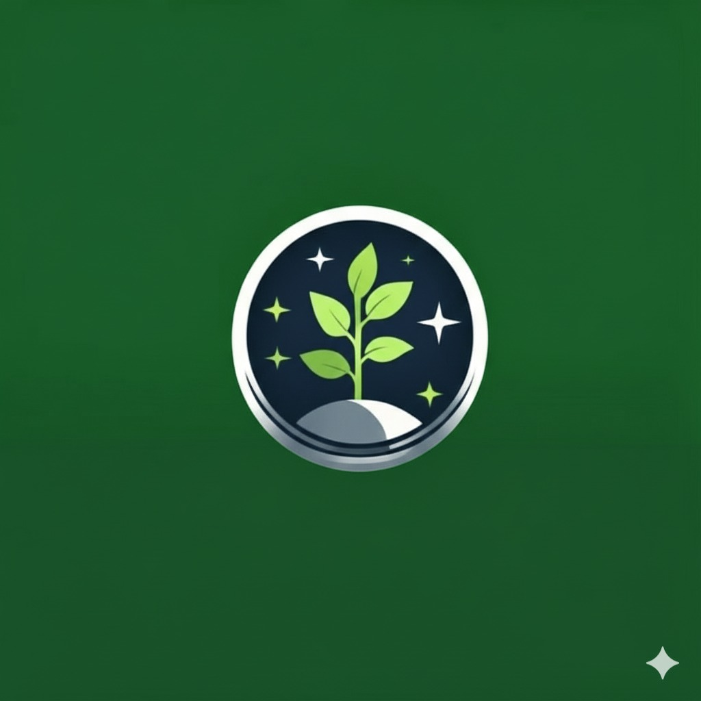

# Farmstellar 🚀

> Live Preview: https://farmstellar.vercel.app/

**[Grow smarter, farm greener—one quest makes sustainability a habit.]**

## 📋 Table of Contents

1. [About the Project](#-about-the-project)
2. [Tech Stack](#-tech-stack)
3. [User Experience Manual](#-user-experience-manual)
4. [The Team](#-the-team)

---

## 📖 About the Project

Farmstellar is designed to promote sustainable farming practices

We built this project because sustainable farming methods exist, but adoption is low due to lack of guidance, motivation, and youth involvement — so we created a system that breaks practices into simple quests, rewards progress, and makes sustainability easier to start, track, and maintain.

### Key Features

- ✨ Quests: tasks that makes you learn sustainable farming through real life practices.
- ✨ AI Chatbot: a multilingual AI chatbot with AI quest generation.
- ✨ Community: a personalised community system meant for farmers to share their works

---

## 🛠 Tech Stack

The technologies and tools used to build this project:

| Category         | Technologies                                           |
| :--------------- | :----------------------------------------------------- |
| _Frontend_       | Next.js, React.js, TypeScript, Tailwind CSS, shadcn/ui |
| _Backend_        | Node.js, Express.js                                    |
| _Database_       | MongoDB                                                |
| _Cloud Services_ | AWS S3 (image storage), Twilio (OTP/SMS)               |
| _Tools_          | Git, ESLint                                            |

---

## 👤 User Experience Manual (Walkthrough)

1.  user enters the webpage and the login/signup page is displayed
    ↳ i. signup page is redirected once the user clicks signup and user info is obtained.
    ii. otp is generated and page will be redirected to profile setup once the right otp is entered.
    iii. profile is set according to the beginner or pro choice and page will be re directed to the dashboard page once the submit button is clicked.

        ↳	i.	login page is redirected once the user clicks login and the username and password is obtained.
            ii.	otp is generated and when the right otp is entered the page will be redirected to the dashboard.

    2.  User is on the dashboard page
        ↳ i. dashboard contains the basic user info and has a leaderboard in it.
        ii. dashboard contains weather alert which they can see and make their move for farming.
        iii. it also contains on going quests that are initiated by the user so the user can keep track of it in the dashboard itself.
        iv. it has trending quests displayed under the leaderboard.
    3.  User clicks the quest page
        ↳ i. quest page contains available quests and has quests for both beginner and pro.
        ii. it showcases the quest completition rate, the total xp you have gained, your level, and total quests available.
        iii. each quests showcases the quest briefing under the quest title.
        ↳ i. user chooses the quest and clicks it.
        ii. mission briefing is showcased on the side and the xp and badge provided will be showcased too.
        iii. preparations and gear check page will be redirected where user checks the required materials.
        iv. steps will be showcased to the user to follow in the next page.
        v. a checkbox will be showcased for user to fill and submit so that they know they followed all the steps.
        vi. geotag photos will be submitted as a proof.
        vii. the quest will be submitted and will be sent for evaluation by ai and once the verification is done xp will be allotted.
        iv. user has the option to raise a request for crops that are not available with suggestions.
    4.  user clicks the rewards page
        ↳ i. these xp points will be used to redeem rewards such as seeds,pesticides,insecticides etc...
        ii. these xp points are exchanged for the items the user selects and a e bill will be generated that can be used to buy things in the associated stores.

    5.  user clicks community page
        ↳ i. community page has posts from other farmers who use the app.
        ii. user can post their works in the community page.
        iii. every post has the like and comment option to make interaction between farmers easier.

    6.  user clicks AI chatbot page
        ↳ i. the AI chatbot answers any question regarding sustainable farming practices.
        ii. it is multilingual and can be accessed in multiple languages.

🤝 The Team
This project was built with ❤️ by:

- 👨‍💻 BHUPESH
- 🧠 SRINIKESH
- 📊 RITHEKA
- ⚙️ RITHNIHA
- 🎨 SANGEETHA
- 🚀 SUBARANJANI
